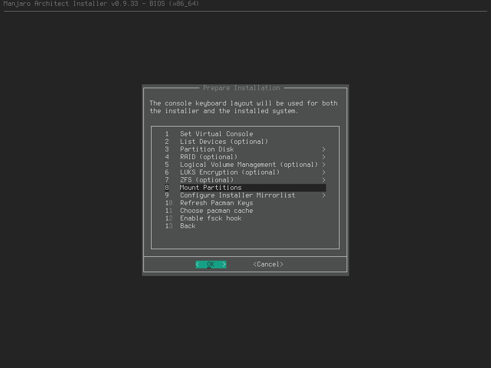
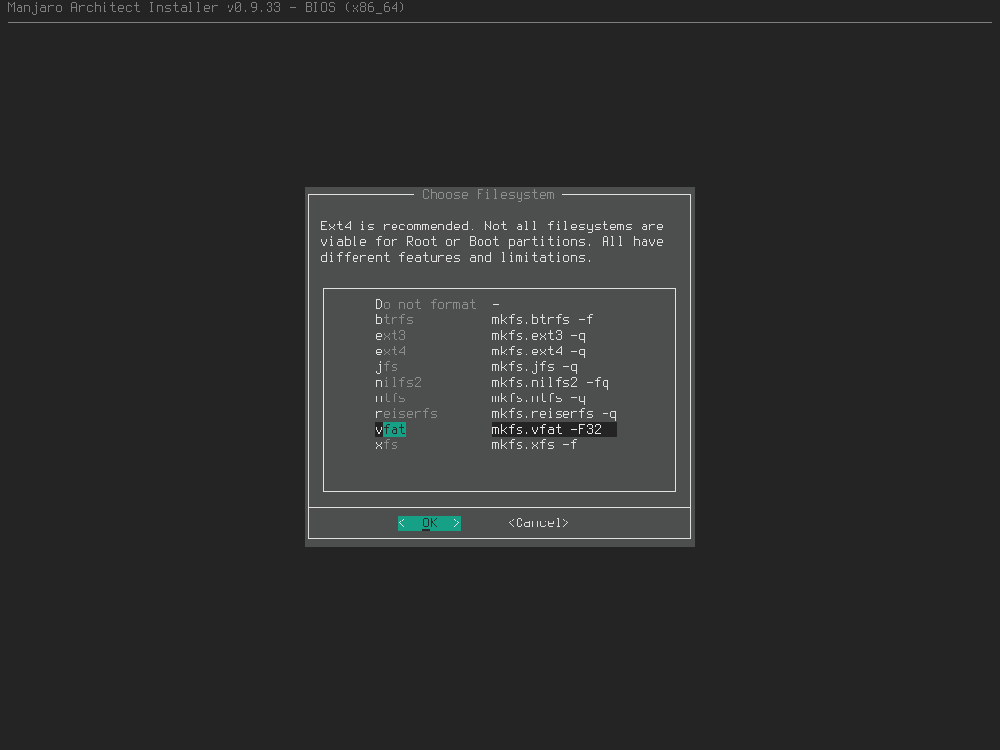

# AfterLife

With introduction of macOS Big Sur Apple stopped to support my MacBook Pro 2012.
This became a good reason to switch to Linux.
Here's my configuration of Manjaro to switch to.

## Installation

### Cusomized Manjaro Installation

- download [Manjaro architect](https://manjaro.org/downloads/official/architect/) and boot
- on the Welcome screen choose the **Boot** option

- enter username and password and start the installer by executing `setup`
- in the **Prepare Installation**
  - choose **Partition Disk**
  - choose the disk
  - choose **Automatic Partitioning**
  
  - when you return back to the **Prepare Installation** screen, choose **Mount Partitions**
  
  - select the ROOT partition (if you don't know which the root, choose the biggest one)
  - select **ext4**
  
  
  - for the swap partition select **Swapfile**
  
  - select another partition for the boot
  
  - select **vfat** as the filesystem
  
  - enter `/boot` as the mount point
  
  - when you return to the **Prepare Installation** screen, choose **Configure Installer MirroList**
  - select **Rank Mirrors by Speed**
  - select **Stable**
  - when you return the **Prepare Installation** screen, choose **Refresh Pacman Keys**
  
  - **Choose pacman cache** - **yes**
  - **Enable fsck hook** - **yes**
- select **Install Custom System** in the **Main Menu**
  - **Install Base Packages**
  
  
  - **Intall Display Driver**
  - **Install Network Drivers**
  - when you back on the screen, choose **Install Unconfigured Desktop Environments**
  - **Install Display Server**
  
  - **Install Desktop environment** - select only **openbox + openbox-themes**
  - on the **Install Common Packages** keep: **bash-completion**, **gnome-icon-theme**, **ttf-dejavu**,
  **xdg-user-dirs**, **xdg-utils**
  - **Install Display Manager** - **lightdm**
  
  - **Install Networking Capabilties**
  - **Install Wireless Device Packages**
  
  - **Install Network Connection Manager** - **connman**
  - **Install CUPS / Printer Packages** - install suggested
  - **Install Multimedia Support**
  - **Install Sound Driver** - default
  - **Install Codecs**
  
  - return back to the **Install Custom System**
  - **Install Bootloader** - **grub**
  
  - **Configure Base**
  - **Generate FSTAB** - **fstabgen -U -p**
  
  - **Set Hostname** - keep it **manjaro** or call whatever you wish
  - **Set System Locale**, **Set Desktop Keyboard Layout** - follow instructions and
  choose options specific to your location
  - **Set Root Password**
  - **Add New User**
  - **Install Custom Packages** - search for and install `termite`
  - return back to the **Main Menu** screen and choose **Done**
  - enter `sudo shutdown now`, unmount installation USB/CD and boot your system
  - when the login screen will appear, hit `Ctrl-Alt-F4`, enter your credentials and 
  proceed with **Environment and Applications Installation**

### Environment and Applications Installation

- `git clone https://github.com/ales-tsurko/afterlife.git`
- `cd afterlife`
- `./setup.sh` (configures desktop)
- `./install_apps.sh` (optional, installs additional apps)

### Setup Configuration

You can configure installation by editing the `setup.sh` and `install_apps.sh` 
before run them.
