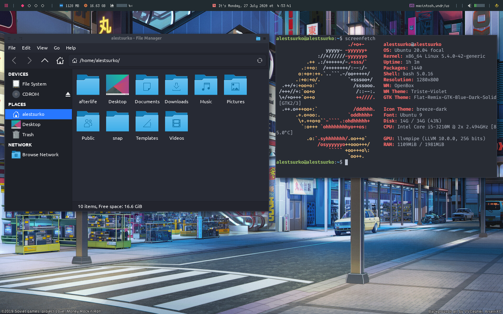

# AfterLife

With introduction of macOS Big Sur Apple stopped to support my MacBook Pro 2012.
This became a good reason to switch to Linux.
Here's my configuration of Ubuntu 20.04 to switch to.

## Installation

- install Ubuntu **command line system** 18.04 using [minimal CD ISO](https://help.ubuntu.com/community/Installation/MinimalCD)
  for this, choose **Command-line install** on the starting page of the installer
- [upgrade to Ubuntu 20.04](https://linuxconfig.org/how-to-upgrade-ubuntu-to-20-04-lts-focal-fossa)
- `sudo apt-get install -y git`
- `git clone https://github.com/ales-tsurko/afterlife.git`
- `cd afterlife`
- `chmod +x setup.sh`
- `./setup.sh`

### Setup Configuration

You can configure installation by editing the `setup.sh` before run it.
